## **Lab 2 Report**
##### CSCY 4742: Cybersecurity Programming and Analytics, Spring 2026

 

**Name & Student ID**: [Your Full Name], [Your Student ID]

---

## **Part 1: Comprehensive Nmap Scanning**

### **Task 1: Basic Network Discovery (Ping Scan)**

#### **Screenshot**:  
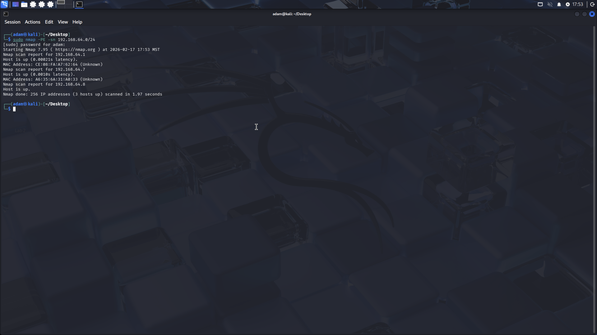

#### **Active Hosts and IP Addresses**:  
The ping scan (-sn) identified the following active hosts on the 192.168.64.0/24 network:

- 192.168.64.1
- 192.168.64.7 (Metasploitable target)
- 192.168.64.8 (Kali attacker machine)

The Metasploitable system (192.168.64.7) was confirmed to be online and reachable.

---

### **Task 2: SYN Scan (Stealth Scan)**

#### **Screenshot**:  
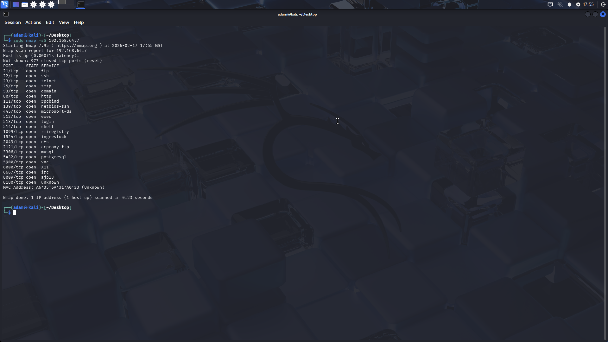

#### **Open Ports Detected**:  

Open TCP ports discovered:

21, 22, 23, 25, 53, 80, 111, 139, 445,  
512, 513, 514, 1099, 1524, 2049, 2121,  
3306, 5432, 5900, 6000, 6667, 8009, 8180

#### **Explanation of SYN Scan's Stealth Advantage**:  

A SYN scan performs a half-open TCP handshake. The scanner sends a SYN packet and analyzes the response without completing the handshake. Because the connection is never fully established, it is less likely to be logged by the target system, making it stealthier than a full TCP connect scan.

---

### **Task 3: TCP Connect Scan**

#### **Screenshot**:  
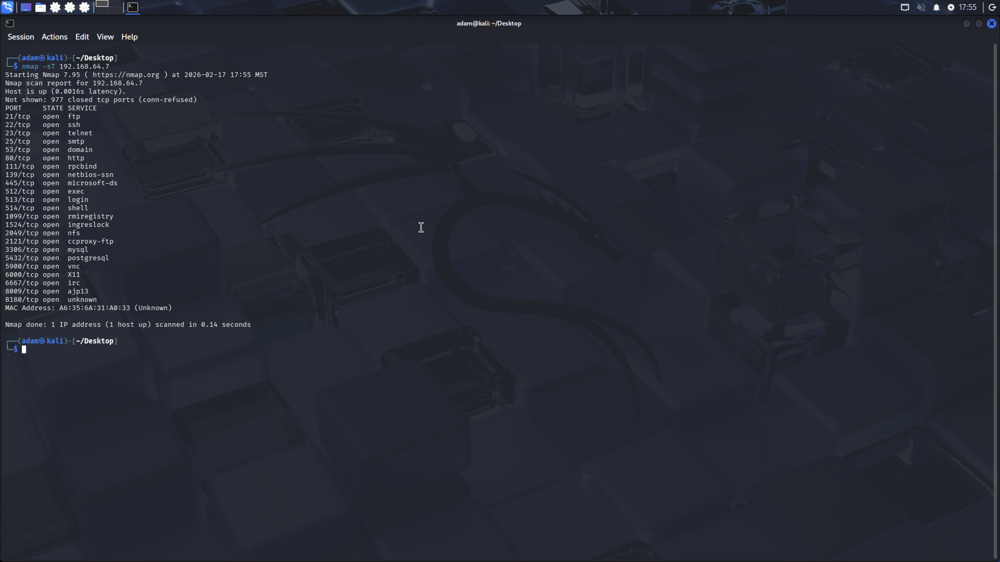

#### **Comparison with SYN Scan**:  

The TCP connect scan completed the full three-way handshake. It detected the same open ports as the SYN scan. However, this method is noisier and more easily logged by intrusion detection systems since connections are fully established.

---

### **Task 4: Service Detection**

#### **Screenshot**:  
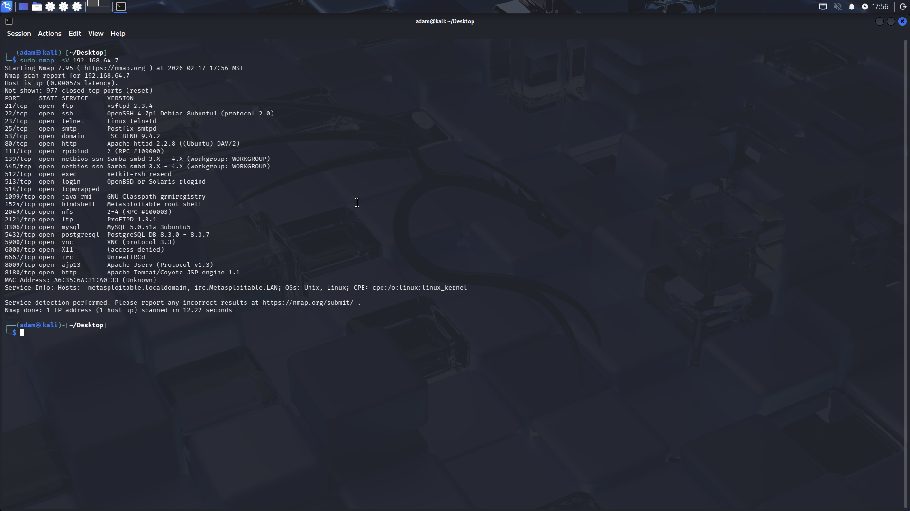

#### **Detected Services and Versions**:  

- FTP – vsftpd 2.3.4  
- SSH – OpenSSH 4.7p1 Debian  
- Telnet – Linux telnetd  
- SMTP – Postfix smtpd  
- DNS – ISC BIND 9.4.2  
- HTTP – Apache httpd 2.2.8 ((Ubuntu) DAV/2)  
- Samba – Samba smbd 3.X  
- MySQL – 5.0.51a  
- PostgreSQL – 8.3.x  
- VNC – protocol 3.3  
- IRC – UnrealIRCd  
- Apache Tomcat (AJP13 and HTTP 8180)

This confirms the target is intentionally vulnerable with many outdated services.

---

### **Task 5: OS Detection**

#### **Screenshot**:  
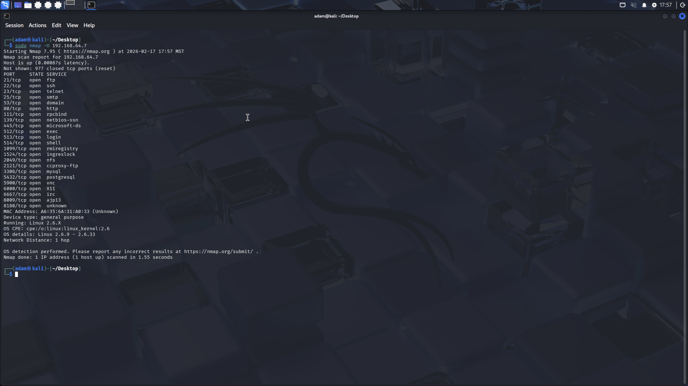

#### **Detected OS and Accuracy**:  

- Running: Linux 2.6.X  
- OS Details: Linux 2.6.9 – 2.6.33  
- Network Distance: 1 hop  

Nmap successfully identified the operating system family as Linux with high confidence.

---

### **Task 6: Timing Profiles**

#### **Screenshot for T1 (Paranoid Mode)**:  
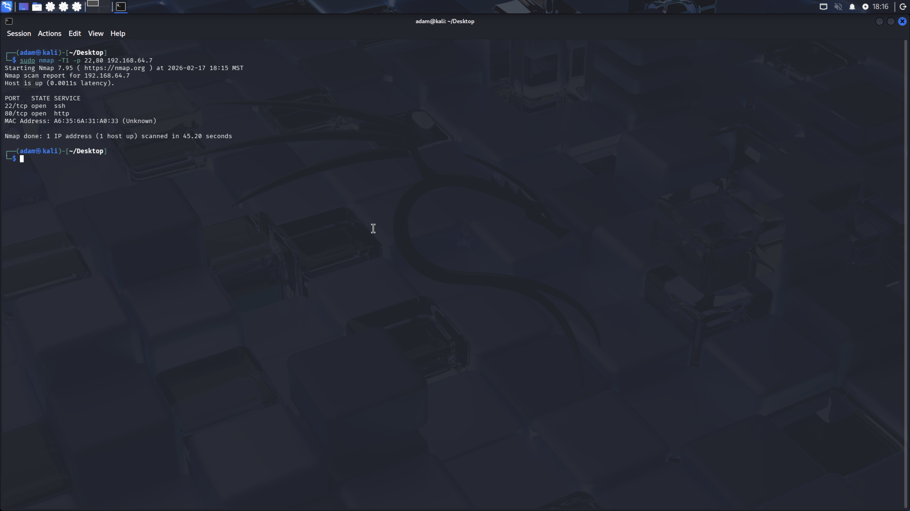

#### **Screenshot for T3 (Normal Mode)**:  
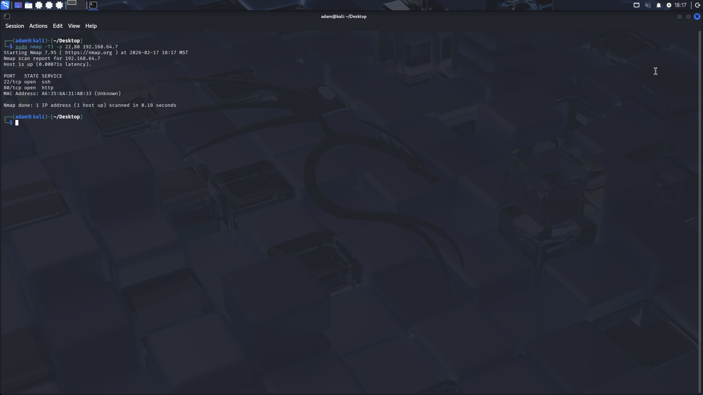

#### **Analysis of Timing Profiles**:  

T1 (Paranoid) took significantly longer to complete because it sends probes very slowly to avoid detection.  
T3 (Normal) completed quickly and is suitable for controlled lab environments.  

This demonstrates how timing templates impact scan speed and stealth characteristics.

---

### **Task 7: UDP Scan**

#### **Screenshot**:  
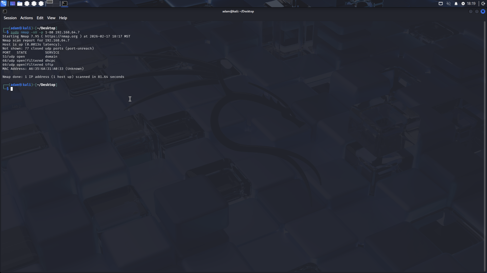

#### **Open UDP Ports**:  

- 53/udp – domain (DNS)  
- 68/udp – dhcp client (open|filtered)  
- 69/udp – tftp (open|filtered)

UDP scanning is slower because UDP does not use acknowledgments like TCP.

---

### **Task 8: Vulnerability Scan**

#### **Screenshot**:  
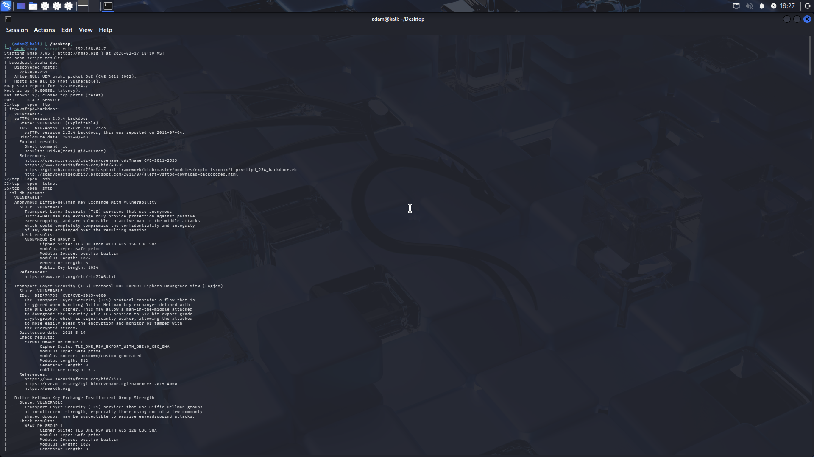  
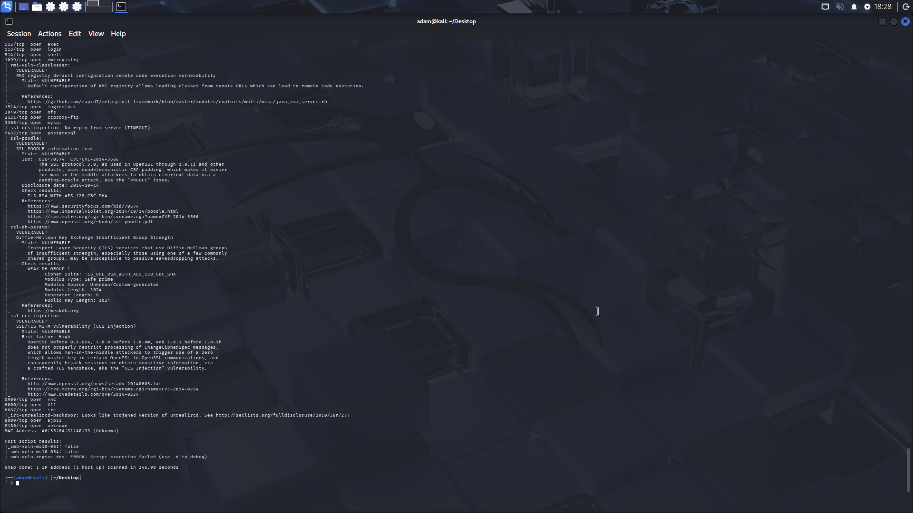

#### **Critical Vulnerabilities Identified**:  

- vsFTPd 2.3.4 backdoor (CVE-2011-2523) – Remote root shell  
- Anonymous Diffie-Hellman MitM vulnerability  
- SSL POODLE (CVE-2014-3566)  
- TLS Logjam (CVE-2015-4000)  
- RMI registry remote code execution  
- UnrealIRCd backdoor  
- Multiple SQL injection points (Mutillidae)

The system is highly vulnerable and intentionally configured for penetration testing practice.

---

### **Task 9: Banner Grabbing**

#### **Screenshot**:  
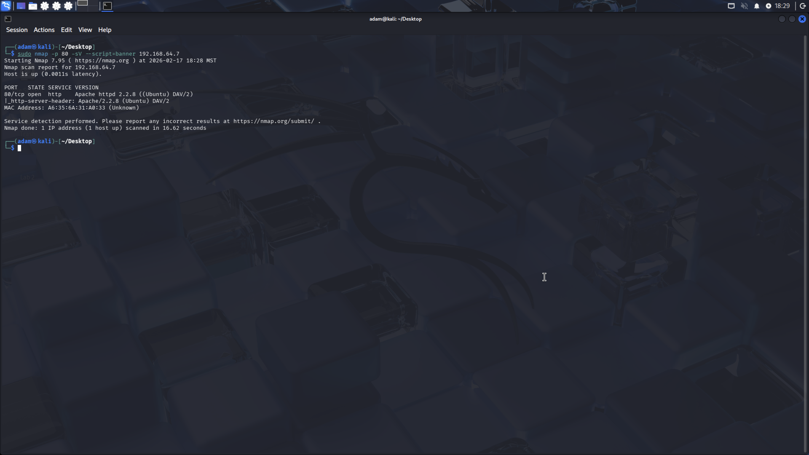

#### **Extracted Banner**:  

Port 80 returned:

Apache httpd 2.2.8 ((Ubuntu) DAV/2)

Banner grabbing reveals service type and version information. Attackers use this data to search for known exploits targeting specific versions.

---

### **Part 1 Summary and Analysis**

The comprehensive Nmap scanning of the Metasploitable system revealed numerous open ports, outdated services, and multiple critical vulnerabilities. The system runs Linux 2.6.x and hosts intentionally insecure applications such as Mutillidae and DVWA.

Different scan techniques demonstrated trade-offs between stealth and speed. SYN scans were stealthier than TCP connect scans, while timing profiles significantly affected scan duration.

Overall, the target is highly vulnerable and provides an ideal environment for penetration testing and exploitation practice.

---

## **Part 2: Python Port Scanner Development**

### **Task 1: TCP Scanner**

#### **Screenshot**:  
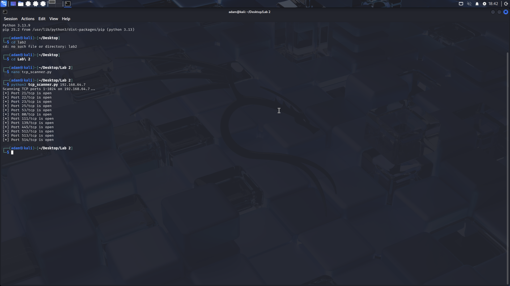

#### **Answers to Questions**:  

- **Why do we need socket.AF_INET and socket.SOCK_STREAM?**  
  AF_INET selects IPv4 addressing, and SOCK_STREAM selects TCP. Together they create an IPv4 TCP socket for connecting to TCP ports.

- **What does settimeout(1) do?**  
  It limits how long the socket waits for a connection attempt before failing, preventing the scan from hanging on filtered/unresponsive ports.

- **What types of exceptions might occur?**  
  Timeouts (filtered/no response), connection refused (closed port), and OS/network errors (no route, host unreachable).

- **Why handle exceptions in network programming?**  
  Networks are unreliable and targets may refuse, drop, or filter traffic. Exception handling keeps the scanner running and produces usable results.

- **Why check len(sys.argv)?**  
  To ensure the user provided the target IP. Without it, the program can’t scan the correct host.

- **What happens if no arguments are passed?**  
  The script prints usage instructions and exits.

- **Why loop through ports 1–1024? What are these called?**  
  They are “well-known ports,” commonly used by standard services and are a typical baseline scan range.

- **Does this require sudo? Why/why not?**  
  No. This uses normal TCP connect() through the OS network stack, not raw sockets.

---

### **Task 2: UDP DNS Port Scanner**

#### **Screenshot**:  
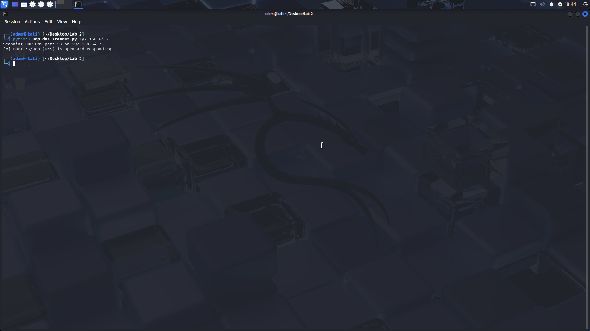

#### **Answers to Questions**:  

- **Why use socket.SOCK_DGRAM?**  
  SOCK_DGRAM creates a UDP socket. UDP is connectionless, so we send datagrams without a handshake.

- **What does timeout do?**  
  It prevents the program from waiting forever for a UDP response since UDP services may not respond.

- **Purpose of query bytes?**  
  They form a valid DNS query packet (A record for example.com). Using a real DNS request increases the chance of a meaningful response.

- **Why recvfrom(512)? What is 512?**  
  512 bytes is the traditional maximum UDP DNS response size. It is a safe buffer size for basic DNS checking.

- **Why is timeout likely in UDP scanning?**  
  UDP has no handshake. A lack of response could mean filtered traffic, a silent service, or open|filtered ports.

- **Why close socket in finally?**  
  Ensures resources are released even if an error occurs.

- **Purpose of sys.argv?**  
  To accept the target IP as input at runtime.

- **Why is input validation important?**  
  Prevents scanning the wrong host and avoids runtime errors from missing/incorrect input.

- **Does this require sudo? Why/why not?**  
  No. UDP datagrams can be sent by normal users; raw packet crafting would require sudo, but this script uses standard sockets.

---

### **Part 2 Summary and Analysis**

The socket module with AF_INET and SOCK_STREAM was utilized by the TCP scanner to establish IPv4 TCP connections. By trying to connect to ports 1–1024 and managing errors like socket and ConnectionRefusedError.Nevertheless, the script was able to identify the open ports. This method is quite similar to a TCP connect scan. The correctness of the scanner was confirmed when the findings matched the open ports previously found using Nmap. In order to keep the program from lingering on filtered or unavailable ports, timeouts and appropriate exception handling were crucial throughout the script's creation.

The problems with connectionless protocols were shown by the UDP DNS scanner. The scanner had to issue a DNS query and determine the port state by determining whether a response was received because UDP does not execute a handshake as TCP does. The port was categorized as open|filtered if no response was received within the timeout period, and as open if a response was returned. This brought to light a significant drawback of UDP scanning: a port's absence of response does not always mean that it is closed.

**UDP Scanning Challenges**

Compared to TCP, scanning UDP services, like DNS on port 53, presents considerable difficulties. Since UDP is a connectionless protocol, a service's reachability may be verified without a handshake. In order to solve this, our `udp_dns_scanner.py` sends a specially constructed DNS query packet and watches for a response. A DNS answer may be returned if the port is open and the service is operational, but many UDP services stay silent if the request is not written correctly or if the service is set up to ignore uninvited probes. This results in the "open|filtered" ambiguity that is frequently seen in UDP scanning: a lack of response may indicate that the port is open but silent or that a firewall is blocking it.

---

## **Part 3: Wireshark Analysis of Scanning Traffic**

### **Task 1: Setup Wireshark for Packet Capture**

#### **Screenshot**:  

---

### **Task 2: Analyze SYN Scan Traffic**

#### **Screenshot (SYN Packets)**:  

#### **Screenshot (SYN-ACK and RST Responses)**:  

#### **Answers to Questions**:  

---

### **Task 3: Inspect UDP DNS Scanning Traffic**

#### **Screenshot (UDP Packets)**:  

#### **Screenshot (DNS Responses/ICMP Errors)**:  

#### **Answers to Questions**:  

---

### **Part 3 Summary and Analysis**

---

## **Part 4: Web Scanning with Nikto (Extra Credit)**

### **Task 1: Nikto Scan**

#### **Screenshot**:  

#### **Significance of Output**:  

---

### **Task 2: Nikto vs. Nmap HTTP Scans**

#### **Screenshot (Nmap HTTP Script)**:  

#### **Comparison Summary**:  

---

### **Part 4 Summary and Analysis**

